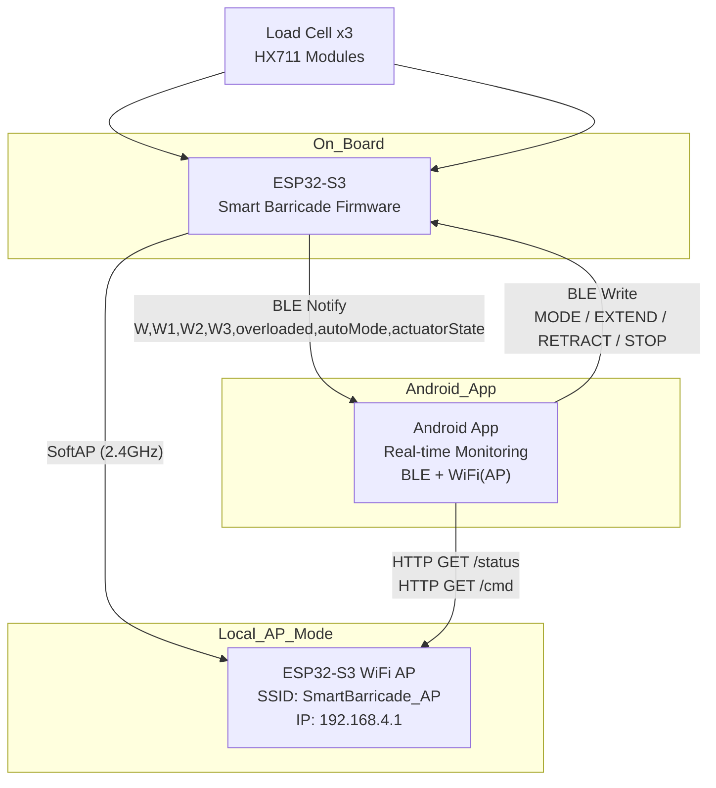

# Smart Barricade Android App

센서를 이용해 무단 침입 · 차량 진입 · 위험 접근을 **물리적 압력(하중) 기반**으로 감지하고, 감지한 값을
**실시간 판단으로 물리적 제어(액추에이터)** 를 도와주는 어플리케이션

주 기능: 실시간 군중 안전 모니터링 · 하중 센서 · LED 패널 · 구조 게이트 제어  
목표: 실시간 군중 안전 모니터링 시스템을 목표로 설계

ESP32-S3 기반 **Smart Barricade 보드**와 Android 디바이스 간  
**BLE + WiFi(AP)** 통신을 사용하여 다음 기능을 제공합니다.

- 로드셀 3개(HX711) 기반 **실시간 하중 모니터링**
- 과부하 시 자동 **바리케이드 자동 확장**
- Android 앱에서 **자동/ 수동 모드 전환** 을 수행

### 앱 역할
- 센서 상태 실시간 시각화
- 위험 단계 표시 (색상 / 아이콘)
- 수동 제어 버튼
- AUTO / MANUAL 모드 전환
- BLE / WiFi 연결 상태 확인(- 실시간 센서 데이터 전송, 제어 명령 전달)

---

## 📡 System Architecture

---

# WiFi AP 모드 – 로컬 HTTP 제어

ESP32-S3는 전시/실험 환경에서 **자체 WiFi AP 모드**로 동작합니다.

- **SSID:** `SmartBarricade_AP`  
- **Password:** `12345678`  
- **IP:** `192.168.4.1`

Android 기기가 AP에 연결되면  
앱 또는 브라우저에서 `/status`, `/cmd` 엔드포인트 호출이 가능합니다.

---
**Adaptive Smart Barricade는**
센서 → 판단 → 물리 제어가 유기적으로 연결된
현장 대응형 IoT 안전 시스템이다.

군중 통제, 전시 공간, 스마트 시티 인프라 등
다양한 환경으로 확장 가능하도록 설계되었다.

