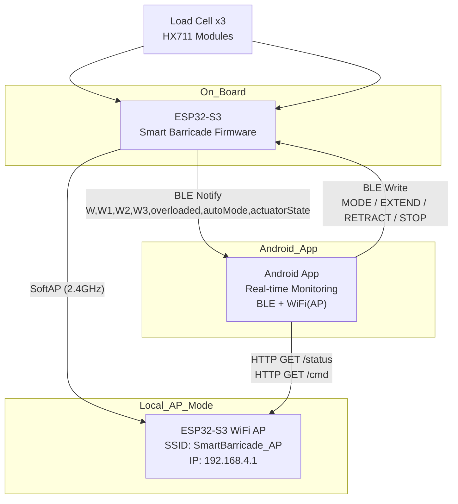

# Smart Barricade Android App

실시간 군중 안전 모니터링 · 하중 센서 · LED 패널 · 구조 게이트 제어  

ESP32-S3 기반 **Smart Barricade 보드**와 Android 디바이스 간  
**BLE + WiFi(AP)** 통신을 사용하여 다음 기능을 제공합니다.

- 로드셀 3개(HX711) 기반 **실시간 하중 모니터링**
- 과부하 시 자동 **바리케이드 EXTEND**
- Android 앱에서 **AUTO / MANUAL 모드 전환**
- **EXTEND / RETRACT / STOP** 버튼 제어
- WiFi AP 모드(`SmartBarricade_AP`)에서 `/status`, `/cmd`로 **로컬 HTTP 제어**

> ⚠️ 현재 버전은 **FastAPI / 외부 서버를 사용하지 않고**  
> ESP32 AP + BLE만으로 동작하는 **로컬 전용 구조**입니다.

---

## 📡 System Architecture



# 실시간 데이터 흐름 (Real-Time Data Flow)


## ▶ ESP32 → Android (BLE Notify)

### 🔹 펌웨어 Notify 포맷 : "W,W1,W2,W3,overloaded,autoMode,actuatorState\n"


### 🔹 필드 설명

| 필드 | 의미 |
|------|------|
| **W** | 대표 하중값(옵션, 총합/평균 등) |
| **W1, W2, W3** | 각 로드셀 측정값 |
| **overloaded** | 과부하 여부 (0 = 정상 / 1 = 과부하) |
| **autoMode** | AUTO = 1 / MANUAL = 0 |
| **actuatorState** | 0 = STOP, 1 = EXTEND, 2 = RETRACT |

Android 앱에서는 Notify 문자열을 `,` 기준으로 split하여  
**그래프, 상태 카드, 알림 UI 등에 반영합니다.**

---

## ▶ Android → ESP32 (BLE Write)

Android 앱에서 버튼 클릭 시 ESP32로 다음과 같은 문자열을 Write합니다.


### 🔹 MODE:AUTO
- THRESHOLD 초과 시 **자동 EXTEND**
- 이후 **10초 유지 로직** 적용

### MODE:MANUAL
- 사용자가 직접 버튼으로 EXTEND / RETRACT / STOP 제어

### CMD 명령
| 명령 | 설명 |
|------|------|
| **CMD:EXTEND** | 릴레이를 통해 바리케이드 전개 |
| **CMD:RETRACT** | 바리케이드 수축 |
| **CMD:STOP** | 동작 즉시 정지 |

> ⚠️ **문자열 포맷은 펌웨어의 파싱 규칙과 반드시 일치해야 합니다.**

---

#  WiFi AP 모드 – 로컬 HTTP 제어

ESP32-S3는 전시/실험 환경에서 **자체 WiFi AP 모드**로 동작합니다.

- **SSID:** `SmartBarricade_AP`  
- **Password:** `12345678`  
- **IP:** `192.168.4.1`

Android 기기가 AP에 연결되면  
앱 또는 브라우저에서 `/status`, `/cmd` 엔드포인트 호출이 가능합니다.

---

## 1) 상태 조회 – `/status` :http://192.168.4.1/status

## 2) 명령 전송 – `/cmd`

### 모드 변경

```http
GET http://192.168.4.1/cmd?mode=AUTO
GET http://192.168.4.1/cmd?mode=MANUAL
#  WiFi AP 모드 – 로컬 HTTP 제어

ESP32-S3는 전시/실험 환경에서 **자체 WiFi AP 모드**로 동작합니다.

- **SSID:** `SmartBarricade_AP`  
- **Password:** `12345678`  
- **IP:** `192.168.4.1`

Android 기기가 AP에 연결되면  
앱 또는 브라우저에서 `/status`, `/cmd` 엔드포인트 호출이 가능합니다.

---

## 1) 상태 조회 – `/status`

요청 예시:

```http
GET http://192.168.4.1/status


## 2) 명령 전송 – `/cmd`

### 모드 변경

```http
GET http://192.168.4.1/cmd?mode=AUTO
GET http://192.168.4.1/cmd?mode=MANUAL

### 액추에이터 제어
GET http://192.168.4.1/cmd?act=EXTEND
GET http://192.168.4.1/cmd?act=RETRACT
GET http://192.168.4.1/cmd?act=STOP
Android 앱은 BLE 우선 제어를 사용하며,
BLE 연결이 불안정할 경우 AP + HTTP로 fallback 제어합니다.

### ESP32 펌웨어 설정
// WiFi AP 설정
const char* AP_SSID     = "SmartBarricade_AP";
const char* AP_PASSWORD = "12345678";

// BLE UUID (Android와 동일해야 함)
#define SERVICE_UUID        "개발자 임의설정"
#define CHARACTERISTIC_UUID "개발자 임의설정"

// BLE Notify 포맷 (앱 파싱 기준)
// "W,W1,W2,W3,overloaded,autoMode,actuatorState\n"

로드셀 설정 관련

OFFSET, SCALE(SET_SCALE) 값은 현장에서 직접 측정 후 보정
THRESHOLD 값은 실제 하중 테스트 후 튜닝


###Android 권한 (Android 12+)
<uses-permission android:name="android.permission.BLUETOOTH_SCAN" />
<uses-permission android:name="android.permission.BLUETOOTH_CONNECT" />
<uses-permission android:name="android.permission.ACCESS_FINE_LOCATION" />


## 프로젝트 구조
app/
├── data/
│ ├── DeviceStatus.kt
│ ├── ConnectionInfo.kt
│ ├── Alert.kt
│ └── AlertsFactory.kt
│
├── ble/
│ ├── BleRepository.kt
│ ├── BleGattCallback.kt
│ └── BleScanner.kt
│
├── network/
│ └── ApClient.kt
│
├── ui/
│ ├── MainActivity.kt
│ ├── BarricadeDetailActivity.kt
│ ├── viewmodel/
│ │ └── MainViewModel.kt
│ ├── adapters/
│ │ └── AlertAdapter.kt
│ └── components/
│ └── HeatSpotRenderer.kt
│
├── utils/
│ ├── PermissionManager.kt
│ ├── HttpClient.kt
│ └── Extensions.kt
│
└── res/
├── layout/
├── drawable/
├── values/
└── mipmap/

---

## 로컬 엔드포인트 요약 (FastAPI 없음)

### ESP32 AP (로컬 전용)

| Method | Endpoint | 설명 |
|--------|----------|--------------------------------|
| GET    | `/status` | 현재 하중 / 모드 / 액추에이터 상태 조회 |
| GET    | `/cmd`    | `mode` 또는 `act` 파라미터로 제어 |

> ⚠️ 이 앱 버전은 **FastAPI·클라우드 서버를 사용하지 않습니다.**

---

##  빌드 & 실행 순서

###  ESP32-S3 펌웨어 업로드
- AP SSID/PW 확인  
- 로드셀 핀 및 **OFFSET / SCALE 보정**  
- 릴레이 핀 번호 확인  
- BLE UUID가 Android 앱 코드와 **정확히 일치하는지 확인**

---

### 2️⃣ Android 앱 실행
- Android Studio → **Run**  
- 첫 실행 시 **BLE + 위치 권한 허용**

---

### 3️⃣ BLE 기능 테스트
- 앱에서 스캔 → **SmartBarricade-*** 선택 → Connect  
- 실시간 하중 그래프 출력 확인  
- **AUTO / MANUAL** 토글 정상 동작 확인  
- **EXTEND / RETRACT / STOP** 버튼 작동 확인

---

### 4️⃣ AP 모드 테스트
- 스마트폰에서 **SmartBarricade_AP** WiFi 접속  
- 앱 내 AP 모드에서 `/status`, `/cmd` 정상 동작 확인  
- 필요 시 브라우저에서 직접 확인:


### 액추에이터 제어
GET http://192.168.4.1/cmd?act=EXTEND
GET http://192.168.4.1/cmd?act=RETRACT
GET http://192.168.4.1/cmd?act=STOP
Android 앱은 BLE 우선 제어를 사용하며,
BLE 연결이 불안정할 경우 AP + HTTP로 fallback 제어합니다.

### ESP32 펌웨어 설정
// WiFi AP 설정
const char* AP_SSID     = "SmartBarricade_AP";
const char* AP_PASSWORD = "12345678";

// BLE UUID (Android와 동일해야 함)
#define SERVICE_UUID        "개발자 임의설정"
#define CHARACTERISTIC_UUID "개발자 임의설정"

// BLE Notify 포맷 (앱 파싱 기준)
// "W,W1,W2,W3,overloaded,autoMode,actuatorState\n"

로드셀 설정 관련

OFFSET, SCALE(SET_SCALE) 값은 현장에서 직접 측정 후 보정
THRESHOLD 값은 실제 하중 테스트 후 튜닝


###Android 권한 (Android 12+)
<uses-permission android:name="android.permission.BLUETOOTH_SCAN" />
<uses-permission android:name="android.permission.BLUETOOTH_CONNECT" />
<uses-permission android:name="android.permission.ACCESS_FINE_LOCATION" />


## 프로젝트 구조
app/
├── data/
│ ├── DeviceStatus.kt
│ ├── ConnectionInfo.kt
│ ├── Alert.kt
│ └── AlertsFactory.kt
│
├── ble/
│ ├── BleRepository.kt
│ ├── BleGattCallback.kt
│ └── BleScanner.kt
│
├── network/
│ └── ApClient.kt
│
├── ui/
│ ├── MainActivity.kt
│ ├── BarricadeDetailActivity.kt
│ ├── viewmodel/
│ │ └── MainViewModel.kt
│ ├── adapters/
│ │ └── AlertAdapter.kt
│ └── components/
│ └── HeatSpotRenderer.kt
│
├── utils/
│ ├── PermissionManager.kt
│ ├── HttpClient.kt
│ └── Extensions.kt
│
└── res/
├── layout/
├── drawable/
├── values/
└── mipmap/

---

## 🧩 로컬 엔드포인트 요약 (FastAPI 없음)

### ESP32 AP (로컬 전용)

| Method | Endpoint | 설명 |
|--------|----------|--------------------------------|
| GET    | `/status` | 현재 하중 / 모드 / 액추에이터 상태 조회 |
| GET    | `/cmd`    | `mode` 또는 `act` 파라미터로 제어 |

> ⚠️ 이 앱 버전은 **FastAPI·클라우드 서버를 사용하지 않습니다.**

---

## 🚀 빌드 & 실행 순서

### 1️⃣ ESP32-S3 펌웨어 업로드
- AP SSID/PW 확인  
- 로드셀 핀 및 **OFFSET / SCALE 보정**  
- 릴레이 핀 번호 확인  
- BLE UUID가 Android 앱 코드와 **정확히 일치하는지 확인**

---

### 2️⃣ Android 앱 실행
- Android Studio → **Run**  
- 첫 실행 시 **BLE + 위치 권한 허용**

---

### 3️⃣ BLE 기능 테스트
- 앱에서 스캔 → **SmartBarricade-*** 선택 → Connect  
- 실시간 하중 그래프 출력 확인  
- **AUTO / MANUAL** 토글 정상 동작 확인  
- **EXTEND / RETRACT / STOP** 버튼 작동 확인

---

### 4️⃣ AP 모드 테스트
- 스마트폰에서 **SmartBarricade_AP** WiFi 접속  
- 앱 내 AP 모드에서 `/status`, `/cmd` 정상 동작 확인  
- 필요 시 브라우저에서 직접 확인:


